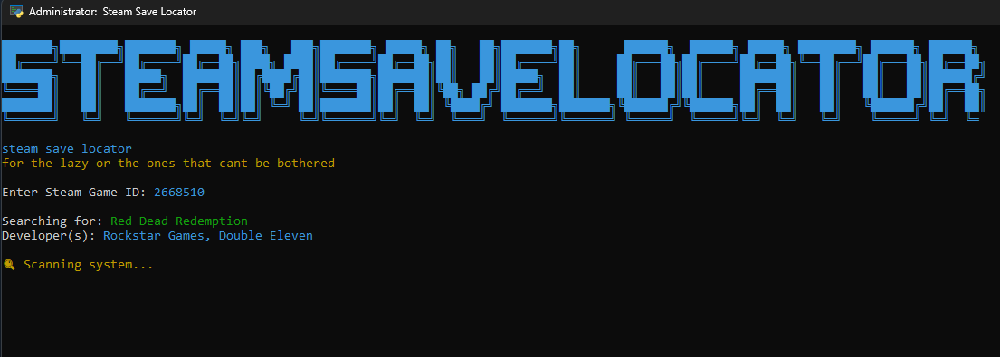

# Steam Save Locator

╔═╗┌┬┐┌─┐┌─┐┌┬┐╔═╗┌─┐┬  ┬┌─┐╦  ┌─┐┌─┐┌─┐┌┬┐┌─┐┬─┐
╚═╗ │ ├┤ ├─┤│││╚═╗├─┤└┐┌┘├┤ ║  │ ││  ├─┤ │ │ │├┬┘
╚═╝ ┴ └─┘┴ ┴┴ ┴╚═╝┴ ┴ └┘ └─┘╩═╝└─┘└─┘┴ ┴ ┴ └─┘┴└─

Ever wondered where your Steam game saves are hiding? This little tool helps you find them without digging through a million folders. Perfect for when you want to back up your progress, move saves to another PC, or just satisfy your curiosity.

---

## What Does It Do?

- **Finds Save Files**: It scans your computer for save files related to your Steam games.
- **Works with Steam Cloud**: If your game uses Steam Cloud, it’ll show you where those saves are stored too.
- **Super Simple**: Just type in the Steam AppID of the game, and it’ll do the rest.

---

## How to Use It

1. Download the latest release from the [Releases section](#).
2. Extract the files and run `SteamSaveLocator.exe`.
3. Type in the Steam AppID of the game you’re looking for (you can find this on SteamDB or the game’s store page).
4. It’ll show you all the places where your saves might be hiding.

**Pro Tip**: If you’re not sure what the AppID is, just Google “[Game Name] Steam AppID” and you’ll find it.

---

## Screenshot

  
*Here’s what it looks like when you run it.*

---

## Why I Made This

I got tired of manually searching through folders like `AppData`, `Documents`, and `Steam Cloud` every time I wanted to back up my saves or if I had problems finding the exact games. So, I made this tool to do the heavy lifting for me. Hopefully, it’ll save you some time too!

---

## Contributing

If you’ve got ideas to make this better or found a bug, feel free to open an issue or submit a pull request. I’m always open to improvements!

---

## License

This project is licensed under the **MIT License**. Basically, you can use it, modify it, and share it however you want. 😄

---

## Questions or Problems?

If something’s not working or you’re confused, just [open an issue](#) and I’ll try to help out.

---
