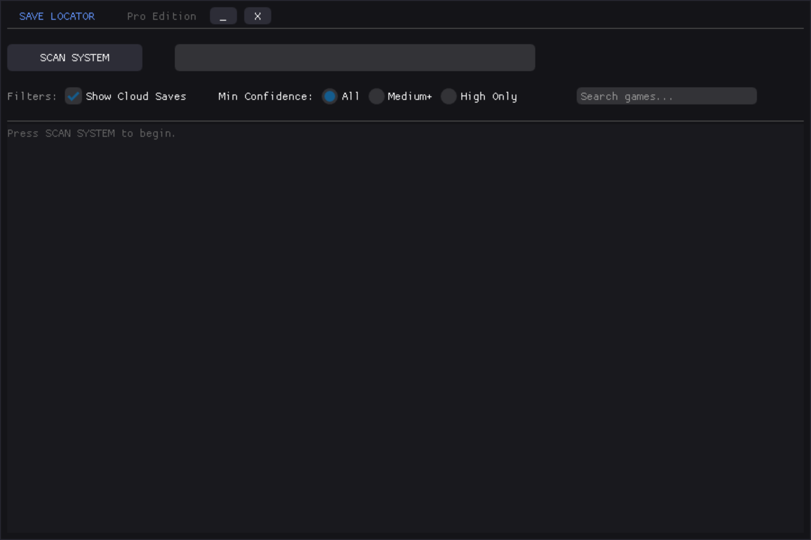

### What's new in v0.4

I basically threw out the old version and rebuilt the entire backend for this one. The biggest change is how it handles nonSteam games. It now has full support for emulators, so if you're using Goldberg, CreamAPI, CODEX, SKIDROW, OnlineFix, or whatever else, the app actually knows exactly where those saves hide.

I also completely changed the confidence system. Instead of the old green/red flags, it now gives every folder a straight 0 to 100% score based on how likely it is to be a real save. It checks folder names, fuzzy matches the game title, and even looks inside for actual save file extensions. 

### How to use

1. Grab the exe from the releases tab and run it. No install needed.
2. Hit the **Scan** button.
3. If you want to find a specific game, just type its name in the search bar.
4. If you're seeing too much junk, change the minimum confidence toggle to 50+ or 75+ to filter out the noise.
5. Click **Open** on any result to jump straight to the folder.

### Features

- **Finds everything** Checks Documents, AppData, Steam Cloud paths, game install folders, and emulator save locations.
- **Smart Filters**  Set minimum confidence scores to hide folders that are probably just game engine junk.
- **Universal Detection**  Works with Steam games, cracked games, and random Windows registry installs. 
- **Cloud Support** Natively works with Steam Cloud saves too (with a toggle to hide them if you only want local files).

### Issues

If you run into any bugs or if it misses a game, feel free to [open an issue](https://github.com/MountainOfWhiteness/steamsavelocator/issues) and I'll take a look. Matches might not be perfect for every single Blackbeard game out there, but I tried to cover the most common ones like Goldberg and CODEX.
